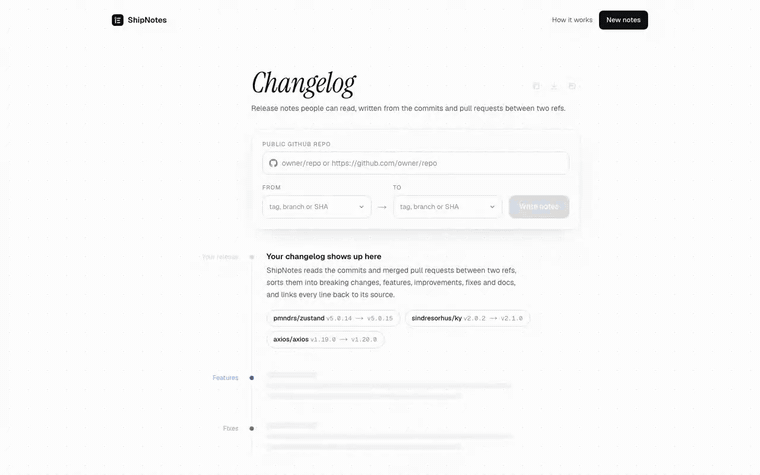
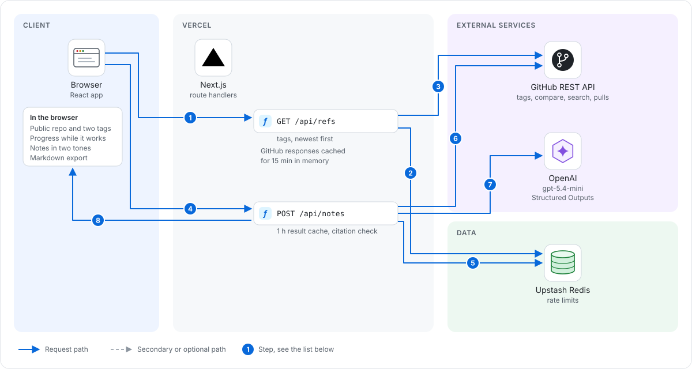
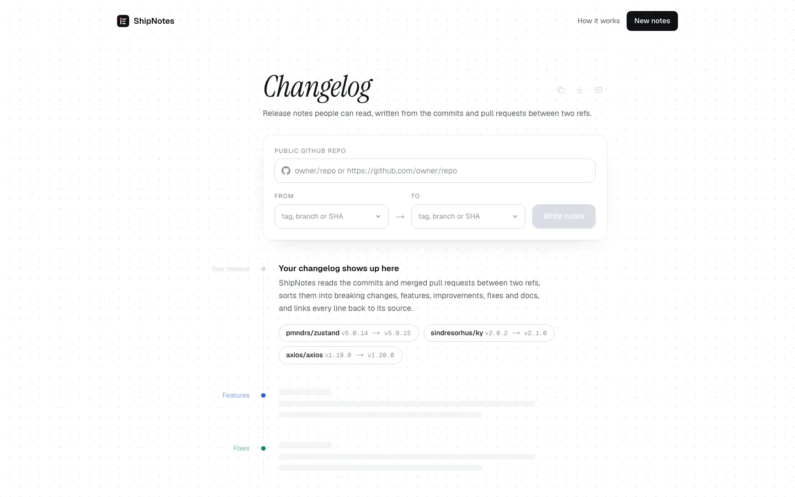
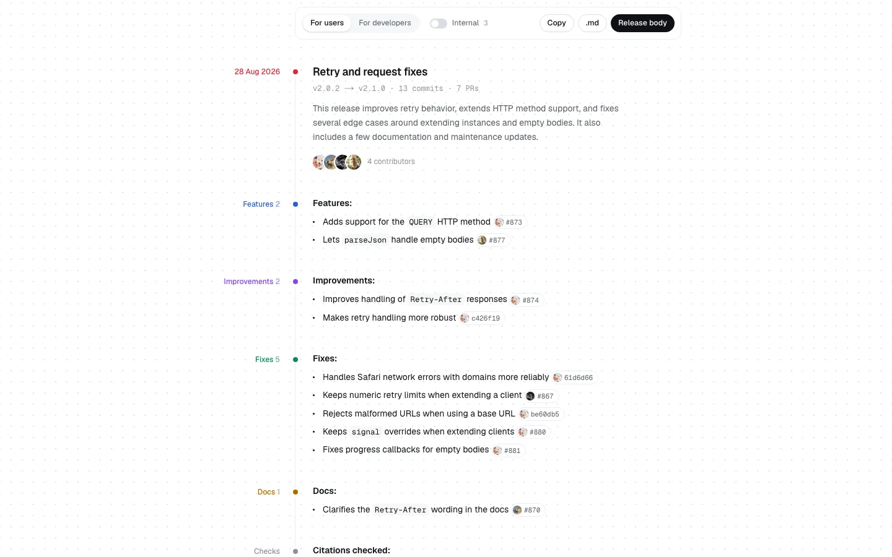

# ShipNotes

Readable release notes from a public GitHub repo and two tags, with every line linked to its PR or commit.

**Live demo:** https://shipnotes-mu.vercel.app



## Why it exists

Maintainers need a first draft of a release body, and users want to know what changed between two versions without reading 40 commit messages. ShipNotes reads the commits and merged PRs between two refs, groups them into breaking changes, features, improvements, fixes, docs and internal work, and writes each change as one line. Every line links back to its source, so you can check each one.

## How it works

1. **GitHub fetch.** The server calls the GitHub REST compare endpoint for `base...head`, then finds the merged PRs behind those commits. PR numbers come from squash subjects (`fix: x (#123)`) and merge commits. For merge commits, every off-mainline commit behind the second parent is credited to that PR. PR titles, bodies, labels and authors come from one search query, with single-PR lookups as a fallback. With `GITHUB_TOKEN` set, commits with no PR number are also checked against `commits/{sha}/pulls`.
2. **One Structured Outputs call.** The OpenAI Responses API (`responses.parse` with `zodTextFormat`) returns a typed object: a headline, a summary, and bullets. Each bullet has a category, a line for users, a line for developers and the IDs of its sources. Both tones come from the same call, so the tone switch costs nothing.
3. **Citation check in code.** Every ref the model returns is resolved against the fetched set. Made-up PR numbers and SHAs are dropped, a bullet left with no valid source is removed, and repeated citations are reported. Any change the model skipped is added back from its own title, using a conventional-commit and label heuristic to pick the category. The page shows the result of these checks under the notes.
4. **Export.** Markdown in GitHub's release format (`- line by @user in <PR url>`, a contributors line, a full changelog link), copy, a `.md` download, and a draft preview that renders that markdown the way a release page shows it.

### Limits and cost controls

- The range is capped at the newest 150 commits (`MAX_COMMITS`). The cap picks the right compare pages, so a large range costs no extra requests.
- GitHub responses are cached in memory for 15 minutes, shaped first so the cache holds no diff payloads. Rate-limit headers are tracked per resource. When the quota is used up, ShipNotes stops calling GitHub and says when it resets.
- Finished notes are cached for an hour. A cached result is served without counting against the rate limit, so the sample buttons are free after the first run.
- `/api/notes` allows 4 uncached runs per IP per hour and `/api/refs` allows 20. The counts are global across instances: they live in Upstash Redis, the hour starts with the first counted request, and a refused request is not counted. A 429 carries `resetAt` and `retry-after`. Without the Redis env vars (local dev, tests) the limiter falls back to process memory, and if Redis is configured but unreachable both routes return 503 "The service is busy, try again in a minute." instead of running unmetered. Input is validated before a request is counted. Bodies over 2KB get a 413.
- The client IP comes from `x-real-ip`, then the last `x-forwarded-for` hop, because the leftmost hop is set by the client. IPv6 addresses are grouped by /64.
- The prompt is capped near 48k characters. PR bodies are stripped of template noise and shortened until the prompt fits. The prompt marks PR text as untrusted data.
- Low reasoning effort, two SDK retries, a 90 second timeout.

A run on the three samples used 1.3k to 5.9k input tokens and 0.7k to 1.7k output tokens on `gpt-5.4-mini`, about $0.005 to $0.012 each.

## Architecture



1. The browser asks `GET /api/refs` for the repo's tags.
2. The route counts the request in Upstash Redis.
3. It reads the tags from the GitHub REST API. GitHub responses are cached in memory for 15 minutes.
4. The browser posts the repo and two refs to `POST /api/notes`. A range generated in the last hour comes back from cache without counting.
5. Otherwise the route counts the run in Redis before any paid call.
6. It fetches the compare range, the merged PRs and their details from GitHub.
7. One OpenAI Structured Outputs call groups the changes and writes both tones.
8. Every cited PR or commit is checked against the fetched set in code, and progress and the result stream back as NDJSON.

Why it is built this way: the OpenAI key and the optional GitHub token stay on the server. Limits are counted in Redis before the paid call, so every instance enforces the same budget. A line whose source cannot be found in the fetched commits and PRs is dropped in code, not trusted.

## Screenshots





A 17 second recording of the ky sample is in [docs/demo.mp4](docs/demo.mp4). The notes were already cached from an earlier run, so they appear at once in the video. The first uncached run took 15.9 seconds and used 1,263 input and 745 output tokens, about $0.0043.

## Stack

- Next.js 16 (App Router), React 19, TypeScript, Tailwind CSS 4
- OpenAI Node SDK: Responses API with Structured Outputs (`gpt-5.4-mini`)
- GitHub REST API (compare, search, pulls)
- zod for request and output schemas
- Deployed on Vercel

## Run it

```bash
cp .env.example .env.local   # add OPENAI_API_KEY
npm install
npm run dev                  # http://localhost:3000
npm test                     # node --test, no build step
npm run lint && npm run build
```

## Config

| Variable | Default | What it does |
| --- | --- | --- |
| `OPENAI_API_KEY` | none | Required. Server only. |
| `OPENAI_MODEL` | `gpt-5.4-mini` | Model for the notes. |
| `GITHUB_TOKEN` | none | Optional. Raises GitHub's limit from 60 to 5000 requests per hour and turns on PR lookups for unlabeled commits. |
| `RATE_LIMIT_NOTES` | `4` | Uncached note runs per IP per window. |
| `RATE_LIMIT_REFS` | `20` | Tag lookups per IP per window. |
| `RATE_LIMIT_WINDOW_MS` | `3600000` | Rate limit window. |
| `KV_REST_API_URL`, `KV_REST_API_TOKEN` | none | Upstash Redis for shared limits. Set by the Vercel integration; `vercel env pull .env.local` for local use. |
| `RATE_LIMIT_NAMESPACE` | `shipnotes` | Redis key namespace; use a different one for local runs against the shared database. |
| `MAX_COMMITS` | `150` | Newest commits read from a range. |
| `PRICE_INPUT_PER_M`, `PRICE_OUTPUT_PER_M` | `0.75`, `4.5` | USD per million tokens, for the cost shown on the page. |

## Tests

`npm test` covers GitHub response shaping (commits, search items, PR template cleanup, merge-commit attribution, compare page math, semver tag sorting), grouping and citation checks (invented refs, empty bullets, duplicates, fallback bullets, prompt budget), markdown output in both tones, HTML rendering with escaping, and the rate limiter.

## Related

Other small apps built on the OpenAI API:

- [Interview Coach](https://github.com/Sahilll15/interview-coach): a spoken mock interview with a report that quotes your answers. Live at https://interview-coach-seven-rose.vercel.app
- [Minutes](https://github.com/Sahilll15/minutes): meeting minutes from diarized audio where every item links back to the transcript. Live at https://minutes-sand.vercel.app
- [SplitSnap](https://github.com/Sahilll15/splitsnap): split a restaurant bill from a receipt photo, exact to the cent. Live at https://splitsnap-sandy.vercel.app
- [AskCSV](https://github.com/Sahilll15/askcsv): ask plain English questions about a CSV, answered with checked SQL in the browser
